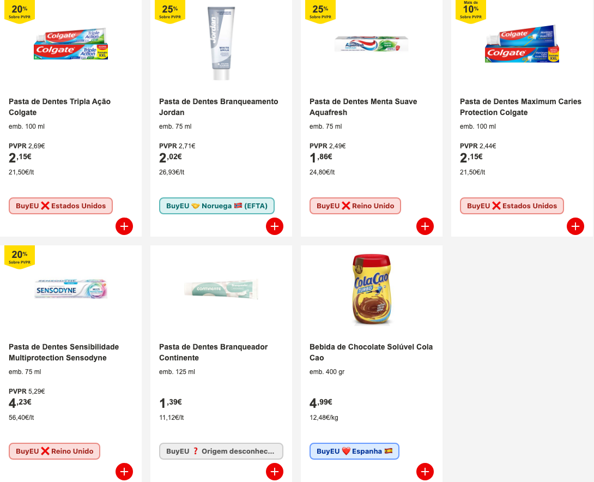
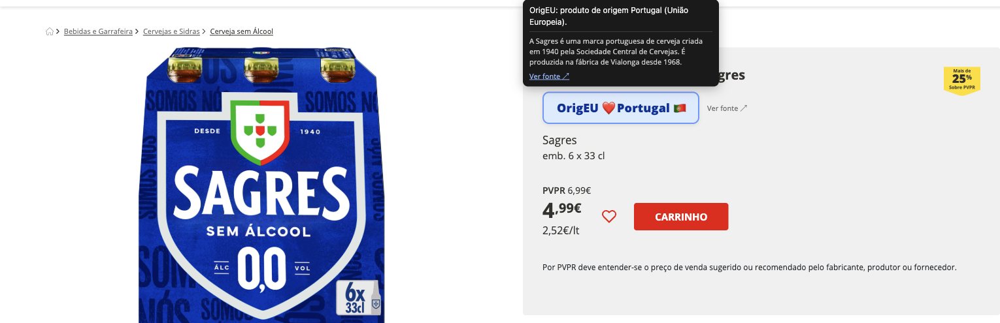

# OrigEU

A small browser extension (Chrome and Firefox) that tells you where a
product actually comes from, right while you're shopping online at a
Portuguese supermarket.

It adds a little badge to each product — on the search/listing page and on
the product page — showing whether that brand is from the EU, from a
closely-linked non-EU country (Switzerland, Norway, Iceland,
Liechtenstein), or from somewhere else entirely.



## What the badges mean

| Badge | Meaning |
|---|---|
| 🇪🇺 OrigEU ❤️ Portugal | Brand is from an EU country |
| 🤝 OrigEU 🇳🇴 (EFTA) | Brand is from Switzerland, Norway, Iceland or Liechtenstein — not EU, but closely tied to it |
| 🌍 OrigEU United States | Brand is from somewhere else |
| ❓ OrigEU Unknown Source | Not in the database yet — you can suggest it from the badge itself |

Click a badge for a source link, when one has been recorded. On a product
page, the badge is bigger and impossible to miss:



Click the toolbar icon to show/hide the badge, or switch it between the
full text shown above and a compact flag-only style.

## Where it works

- continente.pt
- auchan.pt
- pingodoce.pt

## Honest limitations

This is a personal project, not a certified label. The data is
brand-level (not per-product), it's only as complete as what's been
entered, and a brand's general country of origin can occasionally miss a
regional or licensed exception. Treat the badge as a helpful nudge, not a
guarantee — and if you spot something wrong or missing, the badge itself
has a link to suggest a fix.

## Setting it up yourself

The badge data comes from a small database that you host yourself for
free (on Cloudflare) — nobody else's server, no shared account, fully
under your control.

**1. Load the extension**

Chrome (or any Chromium-based browser):
- Clone or download this repository
- Open `chrome://extensions`
- Turn on "Developer mode" (top right)
- Click "Load unpacked" and select the folder you cloned

Firefox:
- Clone or download this repository
- Open `about:debugging#/runtime/this-firefox`
- Click "Load Temporary Add-on…" and select `manifest.json` inside the
  folder you cloned (temporary add-ons unload when Firefox restarts —
  for a permanent local install, package it with
  [`web-ext`](https://extensionworkshop.com/documentation/develop/web-ext-command-reference/)
  and self-sign it, or submit it to
  [addons.mozilla.org](https://addons.mozilla.org))

Then visit continente.pt, auchan.pt or pingodoce.pt and search for a
product.

At this point every product will show "unknown" — that's expected, there's
no database connected yet.

**2. Deploy your own database**

Follow the step-by-step guide in [`backend/README.md`](backend/README.md).
It's free at this scale on Cloudflare's Workers + D1, and takes about 10
minutes. At the end you'll have your own private backoffice where you add
brands and countries yourself.

**3. Point the extension at it**

```bash
cp lib/config.example.js lib/config.js
# edit lib/config.js: set BACKEND_URL to the Worker URL from step 2
```

Reload the extension (`chrome://extensions` or
`about:debugging#/runtime/this-firefox`) and you're done — the badge will
start showing real data for whatever brands you've added.

## Want the technical details?

`ARCHITECTURE.md` covers how the matching works, the supported sites'
platform details, and how to add a new site or a new browser target.
